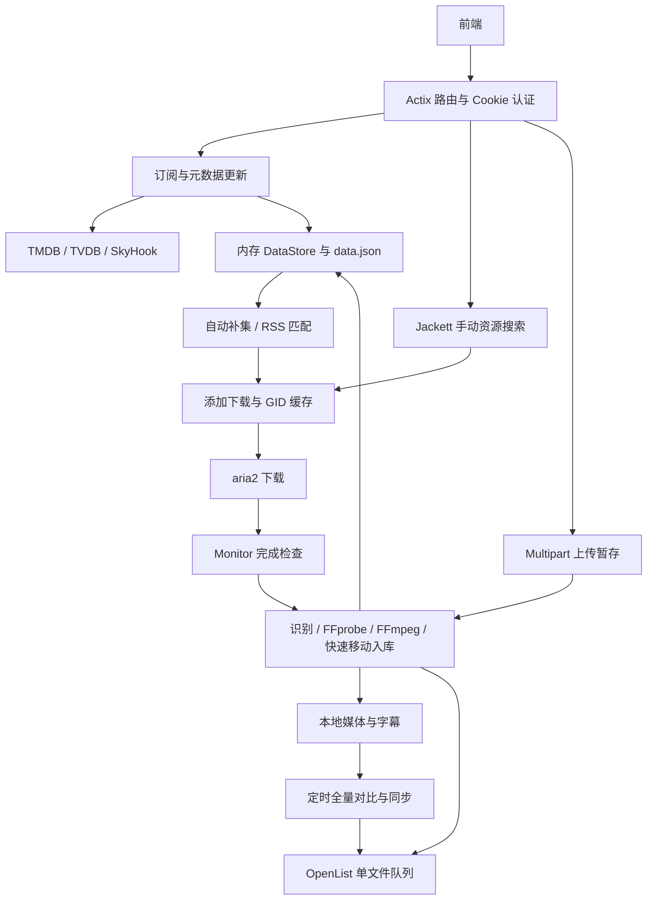

# NCNC Backend 接手与开发说明

本文按当前源码整理，覆盖项目结构、功能与产出、启动配置、前端 API、后台处理逻辑及排障入口。接口以 [src/main.rs](src/main.rs) 的路由注册和各 handler 的实际实现为准。本文示例使用虚构数据，不包含现有配置中的密钥。

**环境约定：本项目最终运行和部署环境仅为 Linux。开发、依赖安装、构建、测试及问题排查均以 Linux 环境为准，不考虑 Windows 生态的兼容、适配或专用依赖问题。即使源码目录位于 Windows 主机，也不改变这一约定；最终构建和运行验证应在 Linux 主机或 Linux 容器中完成。**

项目当前实际运作于192.168.31.183，ssh端口默认，账户root，密码rltx0815，代码位于/opt/Madokami-main/ncnc/backend/。本地Y:\ncnc\backend是该文件夹的网络映射。有必要时可以通过ssh在实际环境中检查代码错误。

快速导航：[代码导航](#2-代码导航) · [启动与配置](#3-启动与配置) · [前端 API](#4-前端-api) · [处理逻辑](#5-核心处理逻辑) · [问题定位](#6-问题定位速查) · [开发验证](#7-开发与验证)

## 1. 项目做什么

这是一个 Rust + Actix Web + Tokio 实现的媒体管理后端，只在 Linux 环境运行，主要面向电视剧／动漫订阅，也支持电影搜索、手动下载和上传整理。

- **元数据**：从 TMDB 搜索和获取季集信息，使用 TVDB 匹配编号，使用 SkyHook 补充播出时间。
- **获取资源**：通过 Jackett 搜索和 RSS 找资源，交给 aria2 下载；也可以由前端上传文件。
- **整理入库**：识别季集、统一命名、按条件转码、提取字幕、提交到媒体目录，更新本地存在状态。
- **云端同步**：整理完成后按需上传到 OpenList，并定时执行全量目录对比。
- **管理界面支持**：提供登录、媒体列表／详情、设置、下载状态、云端上传任务、系统信息和重启接口；托管 `webui/` 静态文件。

最终产出包括：`data.json` 中的订阅及季集信息、本地媒体和字幕文件，以及 OpenList 对应目录中的同步文件。处理源文件只保留到正式文件提交完成，不再额外复制一份长期备份。当前电影流程没有单独的持久化电影列表／订阅接口；`data.json.media` 主要存电视剧订阅。

## 2. 代码导航

| 文件／目录 | 职责与常用定位点 |
| --- | --- |
| [Cargo.toml](Cargo.toml)、[Cargo.lock](Cargo.lock) | 包名和最终二进制名 `ncnc`，Rust 2021；依赖声明、锁定版本及最小化 Release 配置 |
| [build-release.sh](build-release.sh) | Linux 发布脚本；生成精简的 `dist/ncnc`，完成后自动清理 `target/` 构建文件 |
| [src/main.rs](src/main.rs) | 所有路由、全局状态、配置加载、后台服务启动、定时保存、退出和重启 |
| [src/middleware/auth.rs](src/middleware/auth.rs) | Cookie JWT 验证、公开路径、24 小时有效期 |
| [src/handlers/auth.rs](src/handlers/auth.rs) | 登录、密码验证、设置 Cookie |
| [src/handlers/search.rs](src/handlers/search.rs) | TMDB 电视剧／电影搜索 |
| [src/handlers/subscribe.rs](src/handlers/subscribe.rs) | 建立订阅、重复提交控制、后台拉取详情和海报 |
| [src/handlers/media.rs](src/handlers/media.rs) | 媒体查询、删除、追踪设置；列表响应版本缓存 |
| [src/handlers/update.rs](src/handlers/update.rs) | `update_single_media` 更新元数据；`update_media_exists_locally` 本地扫描；`mark_episode_exists` 入库标记 |
| [src/handlers/tvdb.rs](src/handlers/tvdb.rs)、[src/skyhook.rs](src/skyhook.rs) | TVDB 匹配、播出时间补全、时间缓存与是否已播判断 |
| [src/handlers/jackett.rs](src/handlers/jackett.rs) | `resource_search`、`search_episode`：手动资源搜索入口 |
| [src/models/search_filter.rs](src/models/search_filter.rs) | 搜索名称、季集、排除规则、结果排序 |
| [src/models/utils.rs](src/models/utils.rs)、[src/models/constants.rs](src/models/constants.rs) | `parse_season_episode`、路径辅助、文件后缀和解析正则 |
| [src/auto_download.rs](src/auto_download.rs) | 每日缺集搜索、自动下载队列与去重 |
| [src/auto_rss.rs](src/auto_rss.rs) | Torznab RSS 获取、解析、匹配、自动提交下载 |
| [src/handlers/download.rs](src/handlers/download.rs) | 添加下载、读取下载／云端上传缓存、清空下载任务 |
| [src/aria2_client.rs](src/aria2_client.rs) | aria2 JSON-RPC、下载路径、GID 缓存、任务分页 |
| [src/download_cache.rs](src/download_cache.rs)、[src/runtime_state.rs](src/runtime_state.rs) | 内存下载索引、统一运行状态及低频 `runtime_state.json` 快照 |
| [src/monitor.rs](src/monitor.rs) | aria2 子进程、3 秒监控、完成任务处理、缓存清理、目录补扫 |
| [src/handlers/upload.rs](src/handlers/upload.rs) | Multipart 文件接收、上传暂存、后台整理 |
| [src/media_processor.rs](src/media_processor.rs) | FFprobe／FFmpeg、统一命名、backup 工作区和快速移动入库 |
| [src/media_tools.rs](src/media_tools.rs) | 自动压缩开启时检测 FFmpeg／FFprobe，优先使用后端程序同级目录，其次查找 PATH；缓存可用路径或缺失状态 |
| [src/openlist_uploader.rs](src/openlist_uploader.rs) | 单文件队列、全量扫描、远端缓存、上传与删除 |
| [src/rate_limiter.rs](src/rate_limiter.rs) | 外部请求限速工具 |
| [src/handlers/settings.rs](src/handlers/settings.rs) | 配置读写、代理客户端重建、开关触发后台任务 |
| [src/handlers/system.rs](src/handlers/system.rs)、[src/handlers/app.rs](src/handlers/app.rs) | 系统采样、磁盘温度、重启 |
| [src/handlers/mod.rs](src/handlers/mod.rs) | 静态资源和 SPA 回退 |
| [src/models](src/models) | API 请求／响应、配置、媒体和外部服务数据结构 |
| [src/data_store.rs](src/data_store.rs)、[src/io_util.rs](src/io_util.rs) | 内存数据版本、串行持久化、原子 JSON 写入、阻塞任务隔离 |

本目录当前还包含源码压缩包、`target/` 构建产物和运行数据，阅读和修改应以 `src/` 为入口。当前目录未发现 Git 元数据、前端源码、`webui/` 构建产物或 `aria2.conf`，这些部署材料需要另外准备。

## 3. 启动与配置

### 3.1 运行环境

完整媒体链路按 Linux 环境实现，以下依赖、可执行文件及固定路径均以 Linux 为准：

| 依赖 | 当前代码要求 |
| --- | --- |
| Rust / Cargo | 使用能编译当前源码和锁文件的 stable 工具链；项目没有声明 `rust-version` 或固定工具链文件 |
| aria2 | 启动时执行 `/usr/bin/aria2c --conf-path <工作目录>/aria2.conf --stop-with-process=<后端PID>` |
| FFmpeg / FFprobe | 仅在 `media_auto_compress=true` 时检测；关闭时按工具缺失处理。开启时优先检测后端二进制同级目录的 `ffmpeg`、`ffprobe`，其次查找运行环境 PATH，并执行 `-version` 验证可执行；任意一个缺失或不可执行时记录日志，跳过探测、压缩及字幕提取；MP4／MKV 直接移动原文件，其他媒体因无法重新封装而报错并保留源文件。两者可用时，高码率视频使用 Intel QSV / `hevc_qsv`，当前没有软件编码自动回退 |
| TMDB / TVDB | 对应 API Key；TMDB 用于搜索和元数据，TVDB 用于编号匹配 |
| Jackett | 地址、端口和 API Key；需预先配置索引器 |
| OpenList | 地址、端口和 API Key；配置与媒体库根目录相对应的远端目录 |
| smartctl（温度功能） | `/usr/sbin/smartctl`，代码也尝试 `sudo -n`；不可用时温度可为 `null` |

从项目根目录运行，**工作目录必须固定**，因为配置、数据和缓存均相对当前工作目录读写：

```sh
./build-release.sh
RUST_LOG=info ./dist/ncnc
```

发布脚本使用 `opt-level="z"`、完整 LTO、单代码生成单元、`panic="abort"`，并移除调试信息与符号表。编译成功后先将最终文件安装到 `dist/ncnc`，再自动执行 `cargo clean`；因此 `target/` 不会保留，发布和运行应使用 `dist/ncnc`。`panic="abort"` 表示发生未捕获 panic 时进程会直接终止，应由服务管理器负责拉起。

开发运行使用 `cargo run --locked`。服务实际监听 **`0.0.0.0:3000`**，浏览器入口是 `http://localhost:3000/webui`，访问 `/` 会 302 跳转到 `/webui`。

**`config.server_port` 当前只是可读写配置，`main.rs` 的 `.bind("0.0.0.0:3000")` 没有使用它，因此修改配置或重启都不会改变监听端口。**

### 3.2 首次配置

1. 先备份已有 `config.json`、`data.json`，确认是在准备的新环境还是原运行环境操作。
2. 无配置时会生成默认配置，默认登录为 `admin` / `12345`。首次登录后通过设置接口修改账号密码。
3. 配置外部服务、媒体目录和代理。准备环境时将 `jackett_auto_download`、`jackett_auto_rss`、`openlist_auto_upload` 设为 `false`；它们的源码默认值均为 `true`，尤其 RSS 启动即会检查。
4. 准备 `aria2.conf`，使 RPC 监听地址、端口、secret 与后端设置一致。后端不会生成该文件；即使 aria2 启动失败，HTTP 服务也可能正常启动。
5. 准备媒体库、下载和备份目录及读写权限。`media_library_path` 与 `media_backup_path` 必须位于同一文件系统（Linux 下可通过 `stat -c %d <路径>` 核对设备号）；“同一块物理磁盘但位于不同分区／文件系统”仍不满足此要求。放入前端构建产物 `webui/index.html` 后再开启需要的自动化功能。

加载配置失败（包括 JSON 无法反序列化）会生成并保存默认配置；`data.json` 读取或解析失败则回退为空媒体数据。因此发生“配置恢复默认／订阅全空”时，先核对工作目录和文件格式，再执行会保存数据的操作。

### 3.3 配置字段

完整定义见 [src/models/config.rs](src/models/config.rs)。`POST /v1/settings` 是局部更新：未提供或为 `null` 的字段通常保持原值。

| 字段 | 用途／默认值与限制 |
| --- | --- |
| `username`、`password` | 设置接口支持修改；密码保存为 bcrypt；GET 设置不返回这两个字段 |
| `jwt_secret` | 自动生成；只在配置文件中维护，设置 API 不提供修改；改变后旧 Token 无效 |
| `media_library_path` | 媒体库根目录，默认 `/mnt/8tb/NAS`；用于同步范围和系统磁盘选择；必须与 `media_backup_path` 位于同一文件系统，以便已完成输出通过重命名快速移入媒体库 |
| `media_backup_path` | 转码工作目录，默认 `/mnt/8tb/backup`；处理成功后不保留额外源文件副本；必须与 `media_library_path` 位于同一文件系统；**设置 API 未暴露**，停服修改配置后启动 |
| `media_auto_compress` | 是否自动压缩，默认 `true`（旧配置缺少此项也为 `true`）；设置 API 支持读取和更新。关闭时跳过同级目录和 PATH 检测，按工具缺失逻辑处理；保存后对后续处理任务生效，不中断已开始的处理 |
| `media_combine_outputs` | 默认 `true`，把媒体和字幕输出合并到一次 FFmpeg 调用；不是把字幕烧录进视频；**设置 API 未暴露** |
| `server_port` | 默认 `3000`，目前不参与实际监听 |
| `proxy_enabled`、`proxy_address`、`proxy_port` | 默认 `false`、`127.0.0.1`、`7890`；构建 HTTP 代理，修改后重建共享 HTTP Client |
| `tmdb_api_key`、`tvdb_api_key` | 外部元数据服务凭据 |
| `tvdb_token` | 可空的内部 TVDB Token，设置 API 不暴露 |
| `jackett_address`、`jackett_port`、`jackett_api_key` | 默认地址 `127.0.0.1:9117` |
| `jackett_auto_download`、`jackett_auto_rss` | 每日自动补集、RSS 自动发现，彼此独立 |
| `aria_address`、`aria_port`、`aria_rpc_secret` | 默认 `127.0.0.1:6800`，用于 aria2 RPC |
| `openlist_address`、`openlist_port`、`openlist_apikey` | 默认 `127.0.0.1:5244` |
| `openlist_auto_upload` | 控制单文件上传和定时全量同步 |
| `global_filter_terms` | 全局资源排除词，元素是字符串或字符串数组 |

GET 设置会返回外部服务 API Key 和 RPC secret，前端不要把整个响应写入日志。账号修改不会自动轮换 JWT 密钥，现有 Cookie 不会因此立即失效。

Jackett、aria2、OpenList 地址由代码拼成 `http://<address>:<port>`，地址字段应填写主机名或 IP，不要再附加 `http://`。

### 3.4 文件和目录

| 路径 | 内容／用途 |
| --- | --- |
| `config.json` | 服务配置；运行时配置以内存 `CONFIG` 为准，手工改文件需重启 |
| `data.json` | `{"media":{"<tmdbid>": MediaInfo}}`；JSON 对象键是字符串形式 ID |
| `runtime_state.json` | 下载归属和当前处理任务的统一低频快照；以内存状态为准，每 60 秒至多写一次，不记录下载百分比或 FFmpeg 进度 |
| `upload_cache/` | HTTP 上传接收的媒体实体文件；文件本身不能合并进 JSON，任务处理状态位于内存及 `runtime_state.json` |
| `skyhook_cache/<tvdb_series_id>.json` | 播出时间缓存 |
| `openlist_cache.json` | 远端目录文件名／大小缓存，TTL 600 秒 |
| `webui/`、`webui/images/` | 前端静态资源、订阅海报；缺失静态文件会尝试回退到 `index.html` |
| `/mnt/8tb/autodownload/` | **固定下载暂存根目录**，见 `build_download_path` 和 `scan_autodownload_folder`；改媒体库配置不会改变它 |
| `<media_backup_path>/<任务键>/` | 临时转码及字幕输出；不生成事务 JSON，重试时直接清空并从源文件完整重做，成功后删除该任务工作区 |

下载暂存目录取 `media_path` 最后一级目录名，例如媒体路径 `/mnt/8tb/NAS/示例剧` 的第 1 季下载到 `/mnt/8tb/autodownload/示例剧/Season 1`。不同媒体路径如果末级目录同名，会落到相同暂存目录，排查串任务时应检查这一点。

**磁盘布局约束：媒体库与备份目录必须处于同一文件系统。** 转码产生的大文件先写入 `media_backup_path`，完成并校验后使用同文件系统重命名（剪切）移入媒体库；该操作只更新目录项，不再次复制完整媒体内容。仅处于同一块物理磁盘并不充分：如果两个目录属于不同分区、文件系统或挂载设备，重命名会成为跨设备操作并退化为完整复制。

## 4. 前端 API

### 4.1 通用约定与认证

- 除登录、`/` 和 `/webui*` 外，接口都要求 `auth_token` Cookie。**不读取 `Authorization: Bearer ...`**。
- 登录设置 `HttpOnly`、`SameSite=Strict`、`Path=/`、24 小时 Cookie，响应 `data` 也包含 Token 字符串；浏览器应依靠 Cookie 发请求。
- 当前没有 CORS 中间件。前端开发使用开发服务器代理 `/v1`、`/webui` 到后端，生产采用同源部署；单独加 `credentials: 'include'` 不能解决跨域配置问题。
- 普通 POST 使用 `Content-Type: application/json`；三个文件上传接口使用 Multipart，交给浏览器自动设置 boundary。
- **响应没有统一外层结构**。部分返回裸对象／数组，部分是 `success` 包装；业务失败经常仍是 HTTP 200。
- 未登录／失效返回 HTTP 401 的文本错误；框架参数解析错误也不保证 JSON。前端先处理 HTTP 状态和 Content-Type，再判断存在的 `success` 字段。
- 订阅、上传含后台阶段；当前无 WebSocket、SSE 或统一任务状态 API，前端需要轮询相关查询接口。

### 4.2 路由总表

下表 `结果` 表示 `{success: boolean, message: string | null}` 的基本结构；有额外字段会单独列出。路由均直接注册在 `main.rs`，没有其他隐含 `/api` 前缀。

| 方法 | 路径 | 输入 | 响应与行为 | handler |
| --- | --- | --- | --- | --- |
| POST | `/v1/user/login` | `username, password` | `{success, data: Token或null, message}`；失败也为 200 | `auth::login` |
| POST | `/v1/search` | `query` | 裸 TMDB 分页对象，电视剧搜索 | `search::search` |
| POST | `/v1/movie/search` | `query` | 裸 TMDB 分页对象，电影搜索 | `search::search_movie` |
| POST | `/v1/upload/moviesearch` | `query` | 与上项相同的别名 | `search::search_movie` |
| POST | `/v1/subscribe` | 订阅对象，见下文 | 结果；基础信息先保存，详情后台加载 | `subscribe::subscribe` |
| GET | `/v1/media/all` | 无 | **裸 `MediaInfo[]`**，不保证排序 | `media::get_all_media` |
| GET | `/v1/media/{tmdbid}` | 数字路径参数 | **裸 `MediaInfo`**；不存在为 404 | `media::get_media_by_id` |
| POST | `/v1/media/delete` | `tmdbid` | 结果；只删除媒体记录，不删除本地文件、远端文件或 aria2 任务 | `media::delete_media` |
| POST | `/v1/media/settings` | `tmdbid` 和可选设置 | 结果；更新别名、排除词、季追踪 | `media::update_media_settings` |
| GET | `/v1/settings` | 无 | **裸 `SettingsResponseData`** | `settings::get_settings` |
| POST | `/v1/settings` | 可选配置字段 | 结果；保存、必要时重建客户端及触发自动任务 | `settings::update_settings` |
| GET | `/v1/update-all` | 无 | 结果；等待批次处理，单媒体失败写日志，最终仍可能 `success:true` | `update::update_all` |
| GET | `/v1/update-single/{tmdbid}` | 数字路径参数 | 结果；等待 TMDB 更新，TVDB／SkyHook 在后台继续；404／500 表示失败 | `update::update_single` |
| POST | `/v1/resourcesearch` | `tmdbid, season_number, episode_number` | `{success, results: JackettResult[]或null, message}` | `jackett::resource_search` |
| POST | `/v1/download/add` | 剧集下载对象 | `{success, message, gid: string或null}` | `download::add_download` |
| POST | `/v1/download/addmovie` | `display_name, media_path, magnet_uri` | `{success, message, gid}`，无 `tmdbid` | `download::add_movie_download` |
| GET | `/v1/download/all` | 无 | `{success, message, data: DownloadData[]或null}` | `download::get_downloads` |
| POST | `/v1/download/clear` | 无 | `{success, message, gid:null}`；全局清除 aria2 任务／结果及下载缓存 | `download::clear_downloads` |
| GET | `/v1/log/dates` | 无 | `{success, message, data: string[]}`；返回可用日志日期，按日期降序排列 | `logs::get_log_dates` |
| GET | `/v1/log/content` | 查询参数 `date=YYYY-MM-DD` | `{success, message, data: string或null}`；读取指定日期的后端日志 | `logs::get_log_content` |
| GET | `/v1/upload/all` | 无 | `{success, message, data: [{id,name}]或null}`，来自 OpenList 任务缓存 | `download::get_uploads` |
| POST | `/v1/upload/addseason` | Multipart：`tmdbid, season_number, file` | `{success,message,file_count}`；使用指定季，后台按文件名解析集号 | `upload::add_season` |
| POST | `/v1/upload/addepisode` | Multipart：`tmdbid, season_number, episode_number, file` | `{success,message,file_count}`；使用指定季集 | `upload::add_episode` |
| POST | `/v1/upload/addmovie` | Multipart：`display_name, media_path, file` | `{success,message,file_count}`；后台整理电影 | `upload::add_movie` |
| GET | `/v1/systems/info` | 无 | `{success, data: SystemInfo或null, message}` | `system::get_system_info` |
| POST | `/v1/app/restart` | 无 | 结果；约 0.5 秒后发起退出，保存数据后启动当前可执行文件 | `app::restart_app` |
| GET | `/` | 无 | 302 到 `/webui` | `auth::redirect_to_webui` |
| GET | `/webui{任意后缀}` | 静态路径 | 文件／SPA 首页回退；首页也不存在则 404 | `webui_handler` |

两个 `update-*` 虽然使用 GET，实际会修改数据，前端不要预取或当静态资源缓存。当前没有登出、Token 刷新、单任务暂停／取消、电影列表或独立健康检查接口。

### 4.3 请求示例和字段细节

**订阅电视剧**，请求类型见 [src/models/subscribe.rs](src/models/subscribe.rs)：

```json
{
  "tmdbid": 123456,
  "name": "示例剧",
  "original_name": "Example Show",
  "name_tw": "示例劇",
  "poster_path": null,
  "optional_names": ["Example Show"],
  "filter_names": ["生肉"],
  "media_path": "/mnt/8tb/NAS/示例剧",
  "is_anime": true,
  "display_name": "示例剧"
}
```

`tmdbid/name/original_name/optional_names/media_path/is_anime/display_name` 必填；`poster_path` 可省略或 `null`，`name_tw` 默认空字符串，`filter_names` 默认空数组。当前 handler 不使用传入的 `is_anime` 和 `name_tw`，初始 `name_tw` 取 `name`。订阅接口的别名／过滤词仅接受字符串数组；后续媒体设置才接受组合词数组。

**更新媒体追踪与匹配规则**：

```json
{
  "tmdbid": 123456,
  "optional_names": ["Example Show", ["示例", "字幕组"]],
  "filter_names": ["生肉", ["发布组", "RAW"]],
  "seasons_tracked": [false, true]
}
```

除 `tmdbid` 外均可省略。`seasons_tracked[i]` 对应详情响应中 `seasons[i]`，**不是 season_number 等于 i**；超出季数组的项会忽略，未覆盖的季保持不变。空词数组表示清空配置。

`FilterTerm` 是无类型标签的联合：`string | string[]`。外层各规则之间为 OR，内层字符串数组表示 AND（同一标题同时包含所有词）。排除规则命中后剔除；别名规则用于名称匹配。避免提交空的内层数组，`all()` 判断可能使其成为无条件匹配；具体大小写／标点预处理见 `search_filter.rs`。

**添加剧集下载**，类型见 [src/models/download.rs](src/models/download.rs)：

```json
{
  "tmdbid": 123456,
  "season_number": 1,
  "episode_number": 2,
  "magnet_uri": "magnet:?xt=urn:btih:EXAMPLE_HASH",
  "media_path": "/mnt/8tb/NAS/示例剧",
  "is_multi_episode": false
}
```

除 `is_multi_episode` 默认 `false` 外，其余均必填。ID 和季集用 JSON 数字；`media_path` 是后端服务器路径，不是浏览器路径。资源搜索返回合集时应传回 `IsMultiEpisode`，否则完成任务的季集处理方式可能不符合资源内容。电影下载使用 `display_name/media_path/magnet_uri` 三个字符串。

**上传**：同一个 `file` 字段可重复多次，必须带 filename。前端不要使用 `files` 或 `files[]` 字段名。

```js
const form = new FormData();
form.append('tmdbid', '123456');
form.append('season_number', '1');
form.append('episode_number', '2');
for (const file of selectedFiles) form.append('file', file, file.name);
const response = await fetch('/v1/upload/addepisode', {
  method: 'POST', credentials: 'include', body: form
});
```

上传会先写入 `upload_cache/`，再返回并启动后台整理。`file_count` 是接收文件数，**不代表入库成功数**；`/v1/upload/all` 展示云端任务，不能用来查询本次浏览器上传的转码进度。整季上传需要能解析的文件名，例如 `Example.S01E02.mkv`；单集上传可显式指定目标编号。

当前支持媒体后缀 `flv/mkv/mp4/avi/rmvb/m2ts/wmv`，字幕／弹幕后缀 `srt/ass/ssa/sub/smi/xml`。其他后缀可能被接收但后台跳过；最终以 `models/constants.rs` 中的列表为准。

### 4.4 响应模型

**搜索**返回 `{page,results,total_pages,total_results}`。目前请求固定 TMDB 第 1 页，API 没有分页输入。电视剧结果用 `name/original_name/first_air_date`，电影用 `title/original_title/release_date`；共享 `id/poster_path/overview/vote_average` 等。电视剧的 `is_in_library` 依据当前订阅 ID 填充，电影搜索没有同等的电影入库标记逻辑。

**Jackett 资源字段保留大写命名**：`Title`、`Size`、`CategoryDesc`、`Guid`、`MagnetUri`、`Link`、`Details`、`Seeders`、`Peers`、`PublishDate`、`IsMultiEpisode`。除布尔标记外多数字段可为 `null`；不要直接按 `title` 或 `magnet_uri` 读取结果。

**MediaInfo** 的完整类型见 [src/models/media.rs](src/models/media.rs)：

| 层级 | 字段 |
| --- | --- |
| 媒体 | `tmdbid`, `tvdb_series_id?`, `name`, `original_name`, `name_tw`, `poster_path?`, `optional_names`, `filter_names`, `media_path`, `number_of_seasons`, `display_name`, `seasons[]` |
| 季 | `name`, `episode_count`, `season_number`, `is_tracked`, `episodes[]` |
| 集 | `name`, `season_number`, `episode_number`, `absolute_number`, `exists`, `air_date?`, `tvdb_episode_id?`, `tvdb_season_number?`, `tvdb_episode_number?`, `air_date_utc?`, `time_status`, `time_zone_used?` |

表中的 `?` 表示值可空；时间字段通过 `serde(flatten)` **直接位于集对象内**，不存在 `airtime` 子对象。`time_status` 为 `source_utc`、`calculated`、`date_only` 或 `invalid`；`air_date` 通常是 `YYYY-MM-DD`，`air_date_utc` 是带时区的 RFC3339 字符串。

`exists` 表示本地匹配到媒体文件，不能解释成“下载中”或“已同步云端”。季 0 对应 Specials；新季默认追踪规则是最新季，旧季保留原追踪设置。媒体列表来自 HashMap，前端应自行排序。

**下载状态 `DownloadData`**：

| 字段 | 含义 |
| --- | --- |
| `id` | aria2 GID |
| `is_metadata` | 当前实现按 `followedBy` 非空判断，不能当作完整的业务阶段状态机 |
| `name`, `target_path`, `dir` | 任务首个文件名、首个文件路径、下载目录；`target_path` 不是整理后的入库路径 |
| `total_length`, `current_download` | 总量／完成量，字节 |
| `current_speed` | 字节／秒 |
| `progress` | 百分数 0–100，无总长度时为 0 |
| `status` | aria2 状态字符串，如 `active/waiting/paused/complete/error/removed`；`complete` 不等于媒体整理完成 |

`UploadData` 只包含 `id/name`，没有进度字段。系统响应包含 `cpu_usage`、网络 `upload_speed/download_speed`（字节／秒）、`disk_total/disk_used/disk_available`（字节）、`disk_usage_percent`、可空 `disk_temperature`（摄氏度）。磁盘以配置媒体库所在磁盘为目标，网络数据是系统采样，不是单个下载任务速率。

### 4.5 推荐的前端对接顺序

1. 登录并保持 Cookie；统一处理 401，显示登录界面。
2. 读取 `/v1/settings` 和 `/v1/media/all` 构建设置页与媒体列表。
3. 搜索 → 订阅 → 轮询 `/v1/media/{tmdbid}` 等待季集详情 → 配置追踪季。
4. 单集资源搜索 → 选择结果 → 添加下载 → 查询下载状态 → 查询媒体详情确认 `exists`。
5. 手动上传后显示“文件已接收，后台处理中”，后续刷新详情；失败原因从服务日志查。
6. 下载页可按约 3 秒刷新；系统页可按约 1–3 秒刷新。这是前端建议间隔，后台请求和处理时间会使实际数据更旧。

可复用的同源请求封装（兼容裸对象、包装对象和文本错误）：

```js
async function api(path, { method = 'GET', body } = {}) {
  const isForm = body instanceof FormData;
  const res = await fetch(path, {
    method,
    credentials: 'include',
    headers: body !== undefined && !isForm
      ? { 'Content-Type': 'application/json' } : undefined,
    body: body === undefined ? undefined : isForm ? body : JSON.stringify(body)
  });
  const type = res.headers.get('content-type') || '';
  const data = type.includes('application/json') ? await res.json() : await res.text();
  if (res.status === 401) throw new Error('请重新登录');
  if (!res.ok || (data && typeof data === 'object' && data.success === false)) {
    throw new Error(typeof data === 'string' ? data : data.message || data.error || `HTTP ${res.status}`);
  }
  return data; // 不统一取 data.data，调用方按各接口模型读取
}

await api('/v1/user/login', {
  method: 'POST', body: { username: 'admin', password: '你的密码' }
});
const mediaList = await api('/v1/media/all');
```

## 5. 核心处理逻辑



### 5.1 订阅和元数据更新

`subscribe` 先用 `PROCESSING_TMDBIDS` 防止同 ID 并发添加，再检查是否已存在，写入基础 `MediaInfo` 并返回。后台获取 TMDB 详情、季集、本地存在状态，再执行 TVDB 匹配和 SkyHook 时间补全；海报独立下载到 `webui/images/`。

全量更新最多并发处理 3 个媒体，先写回 TMDB 最新数据，再执行 TVDB／SkyHook，避免匹配结果被旧快照覆盖。单项更新的 TVDB／SkyHook 是后台任务，所以返回后仍可能看到编号或时间字段继续变化。

SkyHook 使用 TVDB series ID 获取时间；缓存正常 TTL 6 小时，失败时可使用最多 7 天的旧数据，并包含失败冷却／429 退避。`SKYHOOK_BASE_URL`、`SKYHOOK_HEADERS_JSON` 可覆盖地址／请求头，用于定向服务或测试。

是否已播由 `skyhook::is_episode_aired` 决定：可信 UTC 时间可解析时比较当前 UTC；否则回退到本地日期与 `air_date` 比较。**无日期或日期解析失败时，兼容逻辑会视为可下载，不会阻止自动下载。**

### 5.2 搜索、RSS 和下载去重

手动资源搜索先从已订阅媒体取名称、季集、绝对编号、TVDB 映射，组合 Jackett 查询，经 `search_filter.rs` 识别和过滤、去重与优先级排序。搜索模型与文件名解析共享工具，修改解析规则时应同时检查手动搜索、自动补集、RSS 和本地上传。

自动补集选择追踪季中 `exists=false` 且符合已播规则的集，检查内存统一运行状态中的 `(tmdbid, season, episode)` 键，再搜索并提交 aria2。RSS 则获取 Jackett Torznab feed 后匹配订阅。两者开关独立，关闭每日自动下载不等于关闭 RSS 下载。

aria2 提交成功会在内存统一运行状态中记录 GID 关联。磁力链接可能先产生元数据任务，再通过 `followedBy` 产生实际下载任务；监控需沿关联处理。这些关联还决定完成文件归属和自动下载去重，并由 `runtime_state.json` 低频快照；强制终止可能丢失最近 60 秒的变化。

`/v1/download/all` 返回 aria2 当前存在的下载中、等待、暂停、完成、失败和已移除任务，状态缓存每次都以 aria2 的完整任务列表为准，不额外保留历史记录。`/v1/download/clear` 会处理 aria2 的活动、等待、停止任务及结果。获取完整任务列表失败时不清理，部分移除失败时保留剩余缓存。它没有提供按 `tmdbid` 或 GID 的选择参数。

### 5.3 文件整理与低写入处理

统一入口是 `media_processor::rename_and_move`（剧集）与 `rename_and_move_movie`（电影），全局最多并发处理 3 个，并按源文件和目标文件加锁。

目标命名示例：

```text
<media_path>/Season 1/<display_name> - S01E02.mkv
<media_path>/Specials/<display_name> - S00E01.mkv
<movie_media_path>/<display_name>.mkv
```

媒体目标只使用 MP4 和 MKV：MP4 输入输出 `.mp4`，其余支持的媒体输入输出 `.mkv`。更换封装时必须通过 FFmpeg 生成新容器，不会只修改扩展名。XML 弹幕文件额外使用 `-JP`／`-CN` 后缀；提取的内嵌字幕以语言／标题等标识写为旁挂 `.ass`。

**禁止 FFmpeg 直接向媒体库目录写入转码文件、`.part` 文件或其他临时输出。** 媒体库只接收已经在 `media_backup_path` 中完成并通过校验的文件。转码工作区与媒体库必须位于同一文件系统，校验完成后通过重命名（剪切）快速发布到正式目标路径，避免再次写入完整媒体文件。若部署为不同文件系统，现有跨设备兼容路径会执行完整复制，但这不符合减少磁盘读写的部署目标，应调整挂载或目录配置，而不能改为在媒体库内直接转码。

处理步骤：

1. 检查源／目标、符号链接及 `.aria2` 标记；源目标相同、下载未结束等返回 `Deferred`。
2. 直接在 `media_backup_path/<任务键>/` 建立工作区，不再增加 `.ncnc-work` 中间目录。进入任务时先清除该任务上次遗留的临时输出，不读取或生成 `transaction.json`，也不尝试续接中断的 FFmpeg；只要源文件仍在，就从头重新处理。
3. 先检查 `media_auto_compress`，关闭时按工具缺失处理，开启时使用检测缓存的工具路径。FFmpeg／FFprobe 任意一个缺失时，跳过探测、压缩、字幕提取及生成输出验证；MP4／MKV 走直接移动路径，其他媒体因无法重新封装为 MKV 而返回失败并保留源文件；两者可用时，媒体文件经 FFprobe 获取流和时长。按 `文件字节数 / 时长 / 1024 / 1024 * 8 > 3.5` 判断是否压缩视频；超阈值使用 QSV HEVC，否则视频复制。
4. 首音轨不是 AAC／FLAC／PCM s16le 时，将音轨转 AAC 320k；否则复制。保留第一条视频和所有音轨。
   QSV 视频编码显式使用 `-fps_mode:v:0 cfr`，按 FFmpeg 从输入确定的帧率补帧／丢帧，规整编码前的时间戳，避免自动同步模式下 QSV 输出重复 DTS 导致 MP4 封装失败；不硬编码 24／25／30 fps。仅视频压缩分支使用此选项，视频复制和独立字幕提取不受影响。保留 `-xerror`，解码、编码或封装失败仍中止本次处理。
5. 根据 `KEEP_LANGS` 保留指定语言或无语言标签的字幕：支持的文本字幕提取为旁挂 ASS；PGS 图形字幕在 MKV 输出中原样保留。非 MKV 目标包含 PGS，或遇到其他不支持的字幕格式时，作为确定性错误保留源文件和缓存，并停止本次运行内的自动重试。
6. 输入与目标扩展名不同时，即使不需要压缩或提取字幕，也执行重新封装。需要生成新媒体时，转码和字幕输出全部写入 `media_backup_path/<任务键>/`，验证非空、字幕头、媒体流数量和时长，再以同文件系统重命名（剪切）的方式移入正式媒体目录；不再额外复制源文件备份。媒体库目录内禁止执行转码、字幕提取或产生临时输出。`media_backup_path` 与媒体库配置错误而形成跨文件系统提交时，兼容路径会复制已验证的完整输出并在目标侧原子重命名，但会增加一次完整文件写入，不应作为正常部署方式。无需生成新媒体时也优先使用同文件系统重命名。
7. 提交和源文件清理完成后才返回成功，删除 backup 侧任务工作区，更新本地集存在状态并排入 OpenList 上传。失败通常保留源文件和下载归属，下一次重试从头执行。

`ProcessOutcome` 区分 `Success`、`Deferred`、`Failed`、`CommittedCleanupFailed`；最后一种表示输出已经移入媒体库但源文件或工作区清理未完成，不能简单地把它当成“没生成目标文件”。系统明确接受较弱的崩溃恢复：处理中断不会恢复已完成步骤，浏览器上传后台任务也没有可靠的重启自动重试。上传失败需结合 `upload_cache/` 和日志人工定位。

中断后重新处理时，只要源文件仍存在，就清空 backup 侧对应工作区并按当前源文件重新探测、完整转码；源文件已经被移动而状态快照尚未来得及更新时，任务可能丢失，需要依靠媒体库扫描或人工核对。处理过程中检测到源文件变化仍会停止本次处理，等待下一次从头执行。

仅在 `media_auto_compress=true` 时检测工具；关闭时不查找或执行同级目录及 PATH 中的工具，直接按工具缺失处理。开启时在启动日志初始化后、后台任务启动前检测；若启动时关闭，则延迟到开启后的首次文件处理时检测。关闭开关始终屏蔽已有工具缓存；重新开启后复用本次运行的检测结果。安装或替换工具后需重启后端重新检测。同级工具不可执行或版本检测失败时会继续查找 PATH。

### 5.4 OpenList 同步

整理成功的文件进入有界单文件队列；开启 `openlist_auto_upload` 且文件位于 `media_library_path` 下才会上传。全量同步使用本地媒体库根目录最后一级作为远端根：`/mnt/8tb/NAS/剧名/...` 映射到 `/NAS/剧名/...`。

全量对比按文件名和大小决定是否上传，不做内容 Hash 对比；同名同大小可能跳过。共享上传并发为 5，上传限速 5 QPS，目录列表／删除分别使用 3 QPS 限速，远端目录缓存 TTL 10 分钟。

**全量同步包含远端删除**：在已扫描的对应目录里，若远端媒体／字幕文件在本地不存在，会请求 OpenList 删除。它不是单纯追加备份。本地目录读取不完整时会跳过该目录删除，但正常挂载成空目录等情形仍需部署者核对实际路径。不要将不同内容的远端目录误配为同步目标。

### 5.5 定时任务和缓存刷新

除 UTC 播出时间比较外，以下定时判断使用服务进程本地时区：

| 任务 | 实际触发方式 | 代码 |
| --- | --- | --- |
| 数据保存 | 每 5 秒检查版本，有修改才写 `data.json` | `main.rs`、`data_store.rs` |
| 运行状态快照 | 每 60 秒检查版本，有修改才以宽松原子替换写 `runtime_state.json`；不主动 `fsync` | `main.rs`、`runtime_state.rs` |
| 下载／上传状态 | 循环先等待 3 秒，再获取和处理；耗时会叠加 | `monitor.rs` |
| 孤立下载状态检查 | 约每 60 秒；结合 aria2 是否可达判断 | `monitor.rs` |
| 每日自动补集 | 每 30 秒检查，在本地时间 12:00 分钟内触发，每天一次 | `auto_download.rs` |
| RSS | 启动立即按开关检查，完成后等待 600 秒 | `auto_rss.rs` |
| OpenList 全量同步 | 每 30 秒检查，在每小时前 2 分钟内触发 | `openlist_uploader.rs` |
| 元数据全量更新 | 小时变化且 `hour % 4 == 2`，即 **02/06/10/14/18/22 点所在小时首次检查** | `main.rs` |
| 下载目录补扫 | 小时变化时，只有统一状态中没有下载任务才扫描固定暂存目录 | `main.rs`、`monitor.rs` |
| 系统信息 | CPU／网络约 1 秒，磁盘容量约 15 秒，设备重发现和温度约 60 秒 | `handlers/system.rs` |

`main.rs` 中关于 0/4/8 点的注释与实际条件不一致，上表按代码条件填写。小时检测启动时也会运行一次，因此在目标小时中途启动可能触发更新。每日 12:00 补集没有错过后补跑机制。设置开关由关变开时，自动下载、RSS、OpenList 都会额外立即触发一次。

### 5.6 状态和持久化

`CONFIG` 保存配置；`DATA_JSON` 是带读写锁和版本号的 `DataStore`。媒体以 `Arc<MediaInfo>` 持有，修改用 `Arc::make_mut`；可变访问会增加版本。媒体列表序列化缓存按版本复用，修改后自动失效。`RUNTIME_STATE` 在内存中统一保存下载归属和当前处理任务，替代每任务下载缓存及转码事务 JSON。

保存过程串行化：锁内取快照，锁外做阻塞文件写入，成功才确认保存版本，避免写盘期间的新修改被误标记为已保存。`data.json` 保持强持久化原子写入；`runtime_state.json` 为减少磁盘同步只写同目录临时文件并重命名，不执行 `fsync`，强制断电可能丢失最近快照。退出时先停 HTTP、结束周期保存，再停 aria2，最终写入两份状态；重启请求随后拉起当前可执行文件。

尚未到保存周期的内存修改在强制终止时可能丢失。复制可执行文件到别处运行不会自动带上原数据，工作目录和状态文件应一起作为部署单元维护。

## 6. 问题定位速查

| 现象 | 检查顺序／定位代码 |
| --- | --- |
| 后端正常但 `/webui` 404 | 工作目录是否正确、是否存在 `webui/index.html`；`handlers/mod.rs` |
| 静态 JS 请求返回 HTML | 文件路径／前端构建 base 是否匹配 `/webui`；缺失资源被 SPA 回退；`handlers/mod.rs` |
| 登录成功，后续仍 401 | 是否收到并发送 `auth_token`、开发代理是否同源、Cookie 是否过期；Bearer 无效；`middleware/auth.rs` |
| 改端口后仍是 3000 | `.bind` 写死，检查 `main.rs`，不是设置保存失败 |
| 重启后设置／媒体消失 | 进程 cwd、配置 JSON 完整性、data JSON 结构、文件权限和保存日志；`main.rs`、`data_store.rs` |
| TMDB 搜索 500 | API Key、网络／代理、TMDB 响应是否符合模型；`handlers/search.rs` |
| 已订阅但季集为空 | 订阅有后台阶段；查看 TMDB 更新错误，尝试单媒体更新；`handlers/subscribe.rs`、`handlers/update.rs` |
| `update-all` 成功但部分剧没更新 | 批次响应不汇总单项错误，按 TMDB ID 查 `[UpdateAll]` 日志 |
| TVDB 编号或播出时间缺失 | TVDB Key、匹配到的 series ID、`skyhook_cache/`、冷却时间；`handlers/tvdb.rs`、`skyhook.rs` |
| 没有自动下载 | 季追踪、`exists`、播出时间判断、每日调度是否错过、RSS 独立开关、已有缓存去重；`auto_download.rs`、`auto_rss.rs` |
| 有资源但被过滤／错集 | 别名、组合词、全局及单剧过滤词、TVDB／绝对编号、标题解析；`models/search_filter.rs`、`models/utils.rs` |
| HTTP 可访问但下载不动 | `/usr/bin/aria2c`、`aria2.conf`、RPC 地址／secret、挂载权限；`monitor.rs`、`aria2_client.rs` |
| 下载 100% 但本地 `exists=false` | aria2 完成不等于处理成功；查 `runtime_state.json` 中的 GID 归属、文件路径、FFprobe／FFmpeg 日志；`monitor.rs`、`media_processor.rs` |
| FFmpeg 失败且源文件仍在 | QSV 硬件／驱动／编码器、字幕格式、输出封装兼容、backup 工作区空间／权限；查看 `[媒体处理]` 日志，下次重试会清空工作区后从头执行 |
| `Non-monotonic DTS; previous == current` | 输出包解码时间戳重复，`-xerror` 将其作为失败；`va_openDriver() returns 0` 表示驱动初始化成功。QSV 编码命令应包含 `-fps_mode:v:0 cfr`。临时失败按 1、5、30、60 分钟退避重试；重试会从源文件完整转码，不恢复中断进度 |
| 目录里遗留下载文件未被整理 | 统一运行状态中是否仍有下载任务导致小时补扫跳过、文件名是否能匹配媒体及季集；`runtime_state.json`、`monitor.rs` |
| 上传返回成功但未入库 | 查 `upload_cache/`、解析出的目标季集、后台处理日志；`file_count` 不是处理成功数 |
| OpenList 没上传／云端丢文件 | 自动上传开关、本地文件是否在媒体库根下、远端根映射、目录缓存、大小对比及远端删除日志；`openlist_uploader.rs` |
| 磁盘温度为 null | smartctl 路径、设备识别、权限和 `sudo -n`；`handlers/system.rs`，不要因此判整个服务离线 |

日志默认级别 `info`，直接写入工作目录下的 `logs/backend-YYYY-MM-DD.log`，按服务器本地日期分割，跨天后的第一条日志写入新文件；同一天重启会继续追加。保留当天及前 6 天，共 7 个自然日，启动时清理一次过期日志，之后每天服务器本地时间 00:00 过后清理一次，无日志输出时也会执行清理。仅清理该目录内符合上述命名规则的普通文件。日志目录或文件初始化失败会阻止启动；运行期间写入失败会向标准错误流报告并输出该条日志。

媒体处理在取得并发许可和文件锁后，以 `info` 记录“开始处理文件”及源文件完整路径；仅在提交与清理成功后记录“处理完成，已移入媒体库”及最终文件名。FFmpeg／FFprobe 命令参数、成功子进程的标准错误输出（包括 libva 初始化信息）、文件复制细节及跳过媒体工具的处理分支降为 `debug`；失败、暂缓和提交后清理失败仍保留错误或警告日志。排查命令细节时可设置 `RUST_LOG=info,ncnc::media_processor=debug`。

旧版通过启动脚本重定向生成的单个日志文件不在自动清理范围内，升级后可自行归档或删除。`RUST_LOG` 仍可控制日志级别，例如在隔离环境临时启用模块调试：

```sh
RUST_LOG=info,ncnc::monitor=debug,ncnc::handlers::update=debug ./dist/ncnc
```

常用关键词：`[下载监控]`、`[自动下载]`、`[自动RSS]`、`[媒体处理]`、`[OpenList上传]`、`[OpenList删除]`、`[TVDB]`、`[SkyHook]`、`[UpdateAll]`。部分 debug 日志包含带 API Key 的请求 URL，分享日志前应脱敏。

定位文件处理问题时，同时收集 TMDB ID、季／集、aria2 GID、源路径、目标路径、`runtime_state.json`、backup 侧对应任务键目录和相关错误日志。运行状态是低频快照，内容可能落后于内存；任务目录只用于检查失败输出，不承担恢复功能。

## 7. 开发与验证

```sh
# 检查编译
cargo check --locked

# 检查所有构建目标
cargo check --locked --all-targets
```

自动压缩开关的兼容配置、局部更新及工具缓存屏蔽行为可通过 `cargo test --locked` 验证。编译检查不能替代 aria2、FFmpeg QSV、外部元数据和 OpenList 的部署联调。

QSV 时间戳问题回归时，应使用报错源文件进行**整片**转码（仅截取片尾可能无法复现），输出到独立测试目录。对照日志中的参数加入 `-fps_mode:v:0 cfr`，保留 `-xerror`；成功后用 FFprobe 检查视频包 DTS 严格递增、音视频流及输入／输出时长，再执行 `ffmpeg -v error -xerror -i <测试输出> -map 0:v:0 -map '0:a?' -f null -` 完整解码。验证期间不提交测试输出到媒体库。

部署验证还应分别对 `media_library_path` 和 `media_backup_path` 执行 `stat -c %d <路径>`，确认两者设备号相同；再观察一次真实文件提交，确认走同文件系统重命名而不是跨设备复制。测试转码输出必须写入备份侧或独立测试目录，不能为了测试直接写入媒体库。

建议按改动范围验证：

- 改 API：同步检查路由、请求／响应模型、handler，覆盖真实 HTTP 状态、Cookie、空值和前端调用。
- 改标题解析／过滤：检查文件名、手动资源搜索、RSS、自动补集共享行为，补真实问题样本。
- 改媒体处理：检查成功、失败保留源文件、提交后清理失败、重试及跨盘移动行为。
- 改状态保存：通过 `DataStore` 修改数据，确认列表缓存刷新及重启后的持久化。
- 改同步：使用独立本地和远端测试目录，验证上传、同大小跳过、扫描不完整和远端删除行为。

本文为源码核对文档，编写时没有启动生产服务、触发真实下载／同步或进行外部服务联调。上面的命令是接手后的验证入口，不代表已在当前机器全部运行通过。
